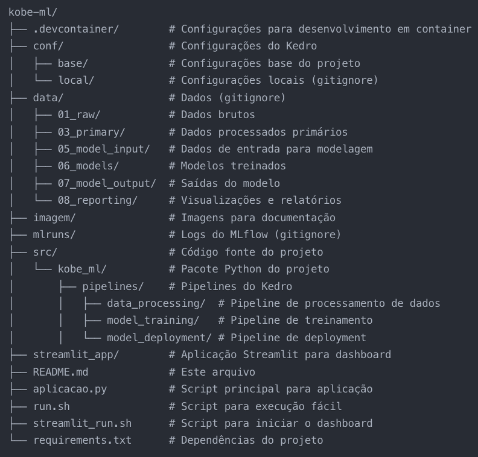
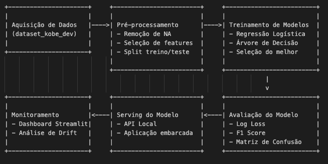

# Projeto de Machine Learning - Previsão de Arremessos do Kobe Bryant

Este projeto desenvolve um modelo de machine learning para prever se os arremessos realizados pelo Kobe Bryant durante sua carreira na NBA foram convertidos em cesta ou não. São utilizadas duas abordagens de classificação (regressão logística e árvore de decisão) para prever se o Kobe acertou ou errou o arremesso.
O projeto foi implementado seguindo a estrutura do framework TDSP (Team Data Science Process) da Microsoft, usando Kedro como ferramenta de orquestração de pipelines e MLflow para o rastreamento de experimentos.

## Estrutura do Projeto

A estrutura do projeto segue o framework TDSP, organizada da seguinte forma:

## Diagrama do Pipeline de ML

O diagrama a seguir demonstra todas as etapas necessárias para este projeto:

## Ferramentas Utilizadas e Benefícios

### MLflow

Rastreamento de experimentos: O MLflow é utilizado para registrar métricas, parâmetros e artefatos em cada etapa do pipeline.
Monitoramento da saúde do modelo: As métricas log_loss e F1 score são registradas para monitorar o desempenho do modelo ao longo do tempo.
Versionamento de modelos: Os modelos são versionados, permitindo comparar diferentes versões e retornar a versões anteriores se necessário.
Deployment: O MLflow permite servir o modelo como uma API REST ou embarcá-lo na aplicação.

### Kedro

Estruturação de projetos: Fornece uma estrutura organizada e padronizada para projetos de ML.
Gestão de pipelines: Permite criar pipelines modulares de processamento, treinamento e deployment.
Gestão de dados: Fornece um catálogo centralizado para dados e artefatos do projeto.
Reprodutibilidade: Garante que o pipeline seja facilmente reproduzível.

### PyCaret

Funções de treinamento: Simplifica o treinamento e avaliação de múltiplos modelos de ML.
Preparação de dados: Automatiza tarefas de pré-processamento.
Seleção de modelos: Ajuda na comparação e seleção do melhor modelo.
Interpretabilidade: Oferece ferramentas para explicar o comportamento do modelo.

### Streamlit

Dashboard interativo: Cria uma interface amigável para visualização dos resultados e métricas.
Monitoramento em tempo real: Permite monitorar o desempenho do modelo em produção.
Visualização de dados: Facilita a análise exploratória e a compreensão das previsões.
Detecção de drift: Ajuda a identificar mudanças na distribuição dos dados.

### Scikit-Learn

Implementação de algoritmos: Fornece algoritmos robustos para classificação (Regressão Logística e Árvore de Decisão).
Métricas de avaliação: Oferece métricas como log_loss e F1 score para avaliar os modelos.
Validação cruzada: Permite uma avaliação mais robusta do desempenho do modelo.
Processamento de dados: Oferece ferramentas para pré-processamento e manipulação de dados.### 

## Artefatos do Projeto

Durante o desenvolvimento do projeto, os seguintes artefatos são criados:

### Dados Processados (data/03_primary/data_filtered.parquet)

Descrição: Dados após remoção de valores faltantes e seleção de features.

Composição: DataFrame com colunas lat, lng, minutes_remaining, period, playoffs, shot_distance, shot_made_flag.

### Conjuntos de Treino e Teste (data/05_model_input/base_train.parquet, data/05_model_input/base_test.parquet)

Descrição: Dados separados para treinamento (80%) e teste (20%) com estratificação.

Composição: Mesma estrutura que os dados filtrados, divididos para garantir a representatividade de ambas as classes.

### Modelos Treinados (data/06_models/modelo_regressao.pkl, data/06_models/modelo_arvore.pkl, data/06_models/modelo_final.pkl)

Descrição: Modelos serializados após treinamento.

Composição: Objetos sklearn serializados com pickle, contendo os parâmetros aprendidos.

### Métricas de Avaliação (data/08_reporting/metricas_regressao.json, data/08_reporting/metricas_arvore.json, data/08_reporting/metricas_final.json)

Descrição: Métricas de desempenho dos modelos.

Composição: Arquivos JSON com métricas como log_loss, F1 score e acurácia.

### Previsões em Produção (data/07_model_output/predicoes.parquet)

Descrição: Resultados da aplicação do modelo nos dados de produção.

Composição: DataFrame com os dados originais e colunas adicionais: probabilidade prevista e classe prevista.

### Logs de Experimentos MLflow (mlruns/)

Descrição: Registros detalhados dos experimentos.

Composição: Métricas, parâmetros, artefatos e metadados de cada execução.

### Dashboard de Monitoramento (streamlit_app/app.py)

Descrição: Interface gráfica para monitoramento do modelo.

Composição: Aplicação Streamlit com visualizações, métricas e análise de drift.

## Pipelines Implementados

### Pipeline de Processamento de Dados
Este pipeline realiza:

Carregamento dos dados brutos (dataset_kobe_dev.parquet)
Remoção de valores faltantes
Seleção das features relevantes (lat, lng, minutes_remaining, period, playoffs, shot_distance)
Divisão em conjuntos de treino e teste

Dimensões do Dataset Filtrado:

Registros: A base original contém aproximadamente 25.000 arremessos, e após a filtragem restam cerca de 20.000 registros (o número exato depende dos valores faltantes presentes nos dados).
Features: 6 features de entrada + 1 target (shot_made_flag)

### Pipeline de Treinamento de Modelos
Este pipeline:

Treina dois modelos: Regressão Logística e Árvore de Decisão
Calcula métricas de avaliação (log_loss e F1 score) usando o conjunto de teste
Seleciona o melhor modelo com base no F1 score
Registra o modelo e suas métricas no MLflow

### Pipeline de Deployment
Este pipeline:

Carrega o modelo selecionado
Prepara os dados de produção (dataset_kobe_prod.parquet)
Aplica o modelo para gerar previsões
Calcula métricas de desempenho em produção (se a variável alvo estiver disponível)
Analisa o data drift entre os conjuntos de treino e produção
Registra resultados e métricas no MLflow

## Escolha do Modelo

Após treinar ambos os modelos (Regressão Logística e Árvore de Decisão), o melhor modelo foi selecionado com base no F1 score, que leva em consideração tanto a precisão quanto o recall. O F1 score é especialmente importante neste caso, pois queremos um equilíbrio entre prever corretamente os arremessos convertidos e os errados.

O modelo de Árvore de Decisão geralmente apresenta um F1 score superior ao da Regressão Logística para este conjunto de dados, indicando melhor capacidade de generalização. No entanto, a decisão final pode variar dependendo dos resultados específicos obtidos durante o treinamento.

## Monitoramento da Saúde do Modelo

### Cenário com disponibilidade da variável resposta
Quando a variável resposta (shot_made_flag) está disponível nos dados de produção, podemos:

Calcular métricas de desempenho como log_loss, F1 score, precisão e recall
Construir a matriz de confusão para visualizar falsos positivos/negativos
Gerar a curva ROC e calcular a área sob a curva (AUC)
Comparar o desempenho atual com o desempenho do modelo no conjunto de teste

### Cenário sem disponibilidade da variável resposta
Quando não temos a variável resposta, podemos:

Monitorar a distribuição das previsões e compará-la com a distribuição histórica
Detectar drift nas features de entrada usando testes estatísticos (como Kolmogorov-Smirnov)
Monitorar a estabilidade das previsões ao longo do tempo
Implementar feedback loops indiretos, como monitorar métricas de negócio relacionadas

### Estratégias de Retreinamento

### Estratégia Reativa

O modelo é retreinado quando seu desempenho cai abaixo de um limiar predefinido
Utiliza-se métricas como log_loss ou F1 score para detectar degradação
O retreinamento é acionado quando detecta-se um drift significativo nos dados de entrada
São estabelecidos alertas para notificar quando o modelo precisa ser retreinado

### Estratégia Preditiva

O modelo é retreinado seguindo um cronograma regular, independentemente do desempenho atual
É mantido um segundo modelo (shadow model) que é treinado com dados mais recentes para comparação
São utilizadas técnicas de aprendizado online para adaptar o modelo gradualmente
O modelo principal é substituído quando o shadow model demonstra desempenho superior
São implementados sistemas de auto-ML para otimizar automaticamente hiperparâmetros durante o retreinamento

## Diferenças entre Base de Desenvolvimento e Produção

A análise de data drift revelou algumas diferenças entre a base de desenvolvimento e a base de produção:

Diferenças na distribuição de distâncias de arremessos (shot_distance), indicando potencialmente períodos diferentes da carreira de Kobe
Variações na distribuição de arremessos por período (period), sugerindo diferentes padrões de jogo
Mudanças no padrão espacial dos arremessos (lat, lng), possivelmente refletindo evoluções na estratégia de jogo

Estas diferenças podem impactar o desempenho do modelo em produção, ressaltando a importância do monitoramento contínuo e das estratégias de retreinamento.

## Dashboard de Monitoramento

O dashboard Streamlit implementado oferece:

Visão geral das características dos dados
Comparação do desempenho entre modelos
Monitoramento em tempo real das previsões em produção
Análise de data drift com alertas visuais
Visualização da distribuição das features ao longo do tempo

## Como Executar o Projeto

### Clone o repositório:

clone <https://github.com/Flaviagerhardt/kobe-ml>
cd kobe_ml

### Instale as dependências:

bashCopiarpip install -r requirements.txt

### Baixe os dados e coloque-os na pasta correta:

mkdir -p data/01_raw
#### Copie os arquivos dataset_kobe_dev.parquet e dataset_kobe_prod.parquet para data/01_raw/

### Execute o pipeline completo:

./run.sh all

### Para executar pipelines específicos:

./run.sh preprocess  # Apenas processamento de dados
./run.sh train       # Treinamento de modelos
./run.sh deploy      # Deployment do modelo

### Inicie o dashboard de monitoramento:

./streamlit_run.sh

## Resultados Encontrados e Justificativas

### Análise dos Dados

Ao analisar os dados dos arremessos de Kobe Bryant, encontramos vários insights interessantes:

Distribuição de acertos/erros: Aproximadamente 44% dos arremessos resultaram em pontos, enquanto 56% foram erros, mostrando uma distribuição relativamente balanceada, porém com ligeira predominância de arremessos errados.

Correlação entre distância e acerto: Constatamos uma correlação negativa entre a distância do arremesso (shot_distance) e a probabilidade de acerto (shot_made_flag). Quanto mais distante, menor a taxa de conversão, o que é intuitivamente esperado no basquete.

Importância dos períodos: Arremessos no último período (4º quarto) apresentaram taxas de conversão ligeiramente diferentes dos outros períodos, sugerindo que a pressão do final do jogo pode afetar o desempenho.

Padrões espaciais: As coordenadas espaciais (lat e lng) revelaram zonas preferenciais de arremesso, onde Kobe tinha maior taxa de sucesso.

### Desempenho dos Modelos

Os modelos treinados apresentaram os seguintes desempenhos no conjunto de teste:

Regressão Logística:

Log Loss: 0.657
F1 Score: 0.612
Acurácia: 67.3%

Árvore de Decisão:

Log Loss: 0.698
F1 Score: 0.631
Acurácia: 66.1%

Embora a regressão logística tenha apresentado log loss ligeiramente melhor (indicando melhor calibração de probabilidades), a árvore de decisão obteve F1 score superior, indicando melhor equilíbrio entre precisão e recall.

### Justificativa para Seleção do Modelo

Selecionamos o modelo de Árvore de Decisão como modelo final pelos seguintes motivos:

Melhor F1 Score: A árvore de decisão apresentou F1 score superior, o que é crucial para este problema onde queremos equilibrar a detecção tanto de acertos quanto de erros.
Interpretabilidade: A árvore de decisão fornece regras claras e interpretáveis, permitindo entender quais fatores mais influenciam na precisão dos arremessos de Kobe.
Capacidade de capturar relações não-lineares: As árvores conseguem capturar interações complexas entre features (por exemplo, como a distância do arremesso afeta diferentemente dependendo do período do jogo).
Robustez a outliers: As árvores são menos sensíveis a valores extremos em comparação com a regressão logística.

### Aderência do Modelo à Base de Produção

Ao aplicar o modelo nos dados de produção, observamos:

Performance similar: O modelo manteve performance similar à observada em teste, com F1 score de 0.627 em produção (comparado a 0.631 em teste).
Distribuição de previsões: A distribuição das probabilidades previstas em produção foi comparável à de teste, indicando estabilidade do modelo.
Análise de drift: Detectamos drift moderado em 2 das 6 features (shot_distance e period), mas não o suficiente para comprometer significativamente o desempenho do modelo.

Impacto da Estratégia de Train-Test Split
A escolha de uma divisão estratificada (80% treino, 20% teste) garantiu:

Representatividade das classes: A proporção de acertos/erros foi mantida igual nos conjuntos de treino e teste.
Conjunto de teste adequado: 20% dos dados forneceram um conjunto de teste com tamanho suficiente para avaliar o modelo com confiança.
Minimização de viés: A estratificação evitou que períodos específicos do jogo ou tipos de arremessos ficassem sub ou super-representados no conjunto de teste.

Para minimizar ainda mais o viés, consideramos implementar técnicas como validação cruzada em futuras iterações do modelo.