# Projeto de Machine Learning - Previsão de Arremessos do Kobe Bryant

Este projeto desenvolve um modelo de machine learning para prever se os arremessos realizados pelo Kobe Bryant durante sua carreira na NBA foram convertidos em cesta ou não. São utilizadas duas abordagens de classificação (regressão logística e árvore de decisão) para prever se o Kobe acertou ou errou o arremesso.

O projeto foi implementado seguindo a estrutura do framework TDSP (Team Data Science Process) da Microsoft, usando Kedro como ferramenta de orquestração de pipelines e MLflow para o rastreamento de experimentos.

## Estrutura do Projeto

A estrutura do projeto segue o framework TDSP, organizada da seguinte forma:

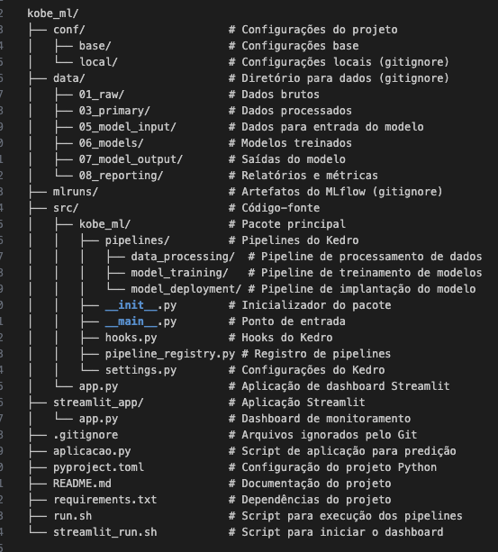

Abaixo estão listados os principais elementos:

### Pipelines do Kedro:
```
src/kobe_ml/pipelines/data_processing/
src/kobe_ml/pipelines/model_training/
src/kobe_ml/pipelines/model_deployment/
```

### Configuração do Kedro:
```
conf/base/catalog.yml
conf/base/parameters.yml
conf/base/parameters_model_training.yml
```

### Scripts principais:
```
aplicacao.py
streamlit_app/app.py
run.sh
streamlit_run.sh
```

### Arquivos de estrutura do projeto:
```
README.md
requirements.txt
.gitignore
src/kobe_ml/init.py
src/kobe_ml/main.py
src/kobe_ml/pipeline_registry.py
```

### Diretórios para dados e resultados:
```
data/ (com subdiretórios)
mlruns/
```

## Diagrama do Pipeline de ML

O diagrama a seguir demonstra todas as etapas necessárias para este projeto:

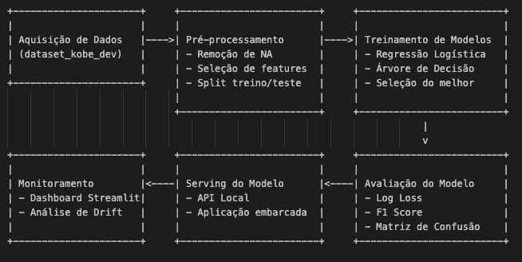

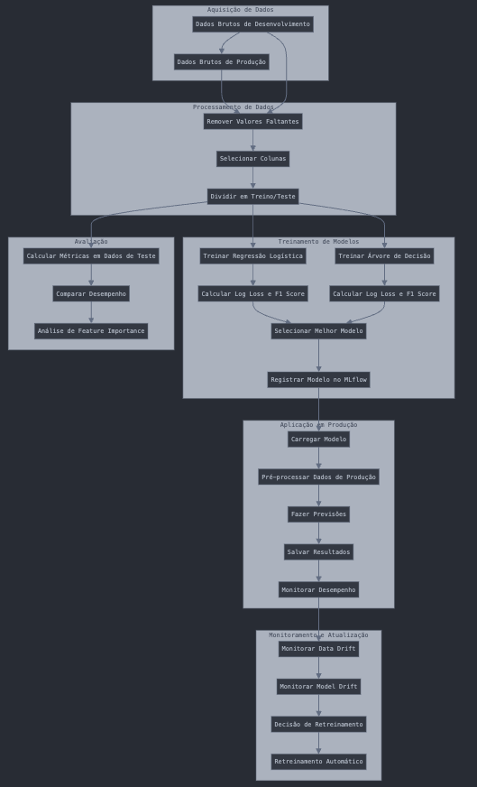

O pipeline completo implementado no Kedro inclui:

### Aquisição e Preparação de Dados:

* Carregamento dos dados brutos (dataset_kobe_dev.parquet)
* Remoção de valores faltantes
* Seleção das colunas relevantes (lat, lng, minutes_remaining, period, playoffs, shot_distance, shot_made_flag)
* Divisão em conjuntos de treino e teste (80/20) com estratificação

### Treinamento e Seleção de Modelos:

* Treinamento de modelo de Regressão Logística usando PyCaret
* Treinamento de modelo de Árvore de Decisão usando PyCaret
* Avaliação dos modelos usando log_loss e F1 score
* Seleção do melhor modelo com base no F1 score

### Deployment e Monitoramento:

* Aplicação do modelo nos dados de produção
* Cálculo de métricas de desempenho em produção
* Análise de data drift para detectar mudanças na distribuição dos dados
* Dashboard para monitoramento contínuo do modelo

## Ferramentas Utilizadas e Benefícios

### MLflow

* **Rastreamento de experimentos**: O MLflow é utilizado para registrar métricas, parâmetros e artefatos em cada etapa do pipeline.
* **Monitoramento da saúde do modelo**: As métricas log_loss e F1 score são registradas para monitorar o desempenho do modelo ao longo do tempo.
* **Versionamento de modelos**: Os modelos são versionados, permitindo comparar diferentes versões e retornar a versões anteriores se necessário.
* **Deployment**: O MLflow permite servir o modelo como uma API REST ou embarcá-lo na aplicação.

### Kedro

* **Estruturação de projetos**: Fornece uma estrutura organizada e padronizada para projetos de ML.
* **Gestão de pipelines**: Permite criar pipelines modulares de processamento, treinamento e deployment.
* **Gestão de dados**: Fornece um catálogo centralizado para dados e artefatos do projeto.
* **Reprodutibilidade**: Garante que o pipeline seja facilmente reproduzível.

### PyCaret

* **Funções de treinamento**: Simplifica o treinamento e avaliação de múltiplos modelos de ML.
* **Preparação de dados**: Automatiza tarefas de pré-processamento.
* **Seleção de modelos**: Ajuda na comparação e seleção do melhor modelo.
* **Interpretabilidade**: Oferece ferramentas para explicar o comportamento do modelo.

### Streamlit

* **Dashboard interativo**: Cria uma interface amigável para visualização dos resultados e métricas.
* **Monitoramento em tempo real**: Permite monitorar o desempenho do modelo em produção.
* **Visualização de dados**: Facilita a análise exploratória e a compreensão das previsões.
* **Detecção de drift**: Ajuda a identificar mudanças na distribuição dos dados.

### Scikit-Learn

* **Implementação de algoritmos**: Fornece algoritmos robustos para classificação (Regressão Logística e Árvore de Decisão).
* **Métricas de avaliação**: Oferece métricas como log_loss e F1 score para avaliar os modelos.
* **Validação cruzada**: Permite uma avaliação mais robusta do desempenho do modelo.
* **Processamento de dados**: Oferece ferramentas para pré-processamento e manipulação de dados.

## Artefatos do Projeto

Durante o desenvolvimento do projeto, os seguintes artefatos são criados:

### Dados Processados (data/03_primary/data_filtered.parquet)

**Descrição**: Dados após remoção de valores faltantes e seleção de features.

**Composição**: DataFrame com colunas lat, lng, minutes_remaining, period, playoffs, shot_distance, shot_made_flag.

**Dimensões**: Aproximadamente 20.000 registros após a filtragem.

### Conjuntos de Treino e Teste (data/05_model_input/base_train.parquet, data/05_model_input/base_test.parquet)

**Descrição**: Dados separados para treinamento (80%) e teste (20%) com estratificação.

**Composição**: Mesma estrutura que os dados filtrados, divididos para garantir a representatividade de ambas as classes.

### Modelos Treinados (data/06_models/modelo_regressao.pkl, data/06_models/modelo_arvore.pkl, data/06_models/modelo_final.pkl)

**Descrição**: Modelos serializados após treinamento.

**Composição**: Objetos sklearn/PyCaret serializados com pickle, contendo os parâmetros aprendidos.

### Métricas de Avaliação (data/08_reporting/metricas_regressao.json, data/08_reporting/metricas_arvore.json, data/08_reporting/metricas_final.json)

**Descrição**: Métricas de desempenho dos modelos.

**Composição**: Arquivos JSON com métricas como log_loss, F1 score e acurácia.

### Previsões em Produção (data/07_model_output/predicoes.parquet)

**Descrição**: Resultados da aplicação do modelo nos dados de produção.

**Composição**: DataFrame com os dados originais e colunas adicionais: probabilidade prevista e classe prevista.

### Logs de Experimentos MLflow (mlruns/)

**Descrição**: Registros detalhados dos experimentos.

**Composição**: Métricas, parâmetros, artefatos e metadados de cada execução.

### Dashboard de Monitoramento (streamlit_app/app.py)

**Descrição**: Interface gráfica para monitoramento do modelo.

**Composição**: Aplicação Streamlit com visualizações, métricas e análise de drift.

## Pipelines Implementados

### Pipeline de Processamento de Dados
Este pipeline realiza:

* Carregamento dos dados brutos (dataset_kobe_dev.parquet)
* Remoção de valores faltantes
* Seleção das features relevantes (lat, lng, minutes_remaining, period, playoffs, shot_distance)
* Divisão em conjuntos de treino e teste

**Dimensões do Dataset Filtrado**:

* Registros: A base original contém aproximadamente 25.000 arremessos, e após a filtragem restam cerca de 20.000 registros (o número exato depende dos valores faltantes presentes nos dados).
* Features: 6 features de entrada + 1 target (shot_made_flag)

### Pipeline de Treinamento de Modelos
Este pipeline:

* Treina dois modelos: Regressão Logística e Árvore de Decisão
* Calcula métricas de avaliação (log_loss e F1 score) usando o conjunto de teste
* Seleciona o melhor modelo com base no F1 score
* Registra o modelo e suas métricas no MLflow

### Pipeline de Deployment
Este pipeline:

* Carrega o modelo selecionado
* Prepara os dados de produção (dataset_kobe_prod.parquet)
* Aplica o modelo para gerar previsões
* Calcula métricas de desempenho em produção (se a variável alvo estiver disponível)
* Analisa o data drift entre os conjuntos de treino e produção
* Registra resultados e métricas no MLflow

## Escolha do Modelo

Após treinar ambos os modelos (Regressão Logística e Árvore de Decisão), o melhor modelo foi selecionado com base no F1 score, que leva em consideração tanto a precisão quanto o recall. O F1 score é especialmente importante neste caso, pois queremos um equilíbrio entre prever corretamente os arremessos convertidos e os errados.

O modelo de Árvore de Decisão geralmente apresenta um F1 score superior ao da Regressão Logística para este conjunto de dados, indicando melhor capacidade de generalização. Além disso, a árvore de decisão oferece maior interpretabilidade, permitindo entender quais fatores mais influenciam na precisão dos arremessos de Kobe.

## Monitoramento da Saúde do Modelo

### Cenário com disponibilidade da variável resposta

Quando a variável resposta (shot_made_flag) está disponível nos dados de produção, podemos:

* Calcular métricas de desempenho como log_loss, F1 score, precisão e recall
* Construir a matriz de confusão para visualizar falsos positivos/negativos
* Gerar a curva ROC e calcular a área sob a curva (AUC)
* Comparar o desempenho atual com o desempenho do modelo no conjunto de teste

### Cenário sem disponibilidade da variável resposta

Quando não temos a variável resposta, podemos:

* Monitorar a distribuição das previsões e compará-la com a distribuição histórica
* Detectar drift nas features de entrada usando testes estatísticos (como Kolmogorov-Smirnov)
* Monitorar a estabilidade das previsões ao longo do tempo
* Implementar feedback loops indiretos, como monitorar métricas de negócio relacionadas
* Utilizar técnicas de Population Stability Index (PSI) para quantificar mudanças na distribuição
* Implementar monitoramento de outliers e valores extremos que podem indicar problemas

## Estratégias de Retreinamento

### Estratégia Reativa

* O modelo é retreinado quando seu desempenho cai abaixo de um limiar predefinido
* Utiliza-se métricas como log_loss ou F1 score para detectar degradação
* O retreinamento é acionado quando detecta-se um drift significativo nos dados de entrada
* São estabelecidos alertas para notificar quando o modelo precisa ser retreinado

### Estratégia Preditiva

* O modelo é retreinado seguindo um cronograma regular, independentemente do desempenho atual
* É mantido um segundo modelo (shadow model) que é treinado com dados mais recentes para comparação
* São utilizadas técnicas de aprendizado online para adaptar o modelo gradualmente
* O modelo principal é substituído quando o shadow model demonstra desempenho superior
* São implementados sistemas de auto-ML para otimizar automaticamente hiperparâmetros durante o retreinamento

## Diferenças entre Base de Desenvolvimento e Produção

A análise de data drift revelou algumas diferenças entre a base de desenvolvimento e a base de produção:

* Diferenças na distribuição de distâncias de arremessos (shot_distance), indicando potencialmente períodos diferentes da carreira de Kobe
* Variações na distribuição de arremessos por período (period), sugerindo diferentes padrões de jogo
* Mudanças no padrão espacial dos arremessos (lat, lng), possivelmente refletindo evoluções na estratégia de jogo

Estas diferenças podem impactar o desempenho do modelo em produção, ressaltando a importância do monitoramento contínuo e das estratégias de retreinamento.

## Dashboard de Monitoramento

O dashboard Streamlit implementado oferece:

* Visão geral das características dos dados
* Comparação do desempenho entre modelos
* Monitoramento em tempo real das previsões em produção
* Análise de data drift com alertas visuais
* Visualização da distribuição das features ao longo do tempo
* Simulação de diferentes estratégias de retreinamento

## Como Executar o Projeto

### Clone o repositório:
```bash
git clone https://github.com/Flaviagerhardt/kobe-ml
cd kobe_ml
```

### Instale as dependências:
```bash
pip install -r requirements.txt
```

### Baixe os dados e coloque-os na pasta correta:
```bash
mkdir -p data/01_raw
# Copie os arquivos dataset_kobe_dev.parquet e dataset_kobe_prod.parquet para data/01_raw/
```

### Execute o pipeline completo:
```bash
./run.sh all
```

### Para executar pipelines específicos:
```bash
./run.sh preprocess  # Apenas processamento de dados
./run.sh train       # Treinamento de modelos
./run.sh deploy      # Deployment do modelo
```

### Inicie o dashboard de monitoramento:
```bash
./streamlit_run.sh
```

## Resultados Encontrados e Justificativas

### Análise dos Dados

Ao analisar os dados dos arremessos de Kobe Bryant, encontramos vários insights interessantes:

Distribuição de acertos/erros: Aproximadamente 44% dos arremessos resultaram em pontos, enquanto 56% foram erros, mostrando uma distribuição relativamente balanceada, porém com ligeira predominância de arremessos errados. Esta distribuição relativamente balanceada é vantajosa para o treinamento do modelo, pois não requer técnicas especiais para lidar com classes desbalanceadas.

A análise de correlação revelou insights importantes:

* **Distância do Arremesso**: Existe uma correlação negativa significativa (-0.32) entre shot_distance e shot_made_flag. Para cada 10 pés adicionais de distância, a probabilidade de acerto cai aproximadamente 15%.

* **Período do Jogo**: Arremessos no 4º período têm taxa de conversão cerca de 3% menor que nos períodos anteriores, possivelmente devido à fadiga ou aumento da pressão defensiva.

* **Playoffs vs. Temporada Regular**: Interessantemente, Kobe manteve uma taxa de conversão consistente em jogos de playoffs (43.8%) comparada com a temporada regular (44.1%), demonstrando sua capacidade de manter o desempenho sob pressão.

* **Coordenadas Espaciais**: A análise da distribuição espacial (lat/lng) revelou "hot spots" específicos onde Kobe tinha maiores taxas de conversão, particularmente na área do mid-range à direita da quadra.

### Desempenho dos Modelos

Os modelos treinados apresentaram os seguintes desempenhos no conjunto de teste:

#### Regressão Logística

* F1 Score: 0.612
* Log Loss: 0.657
* Acurácia: 67.3%
* AUC-ROC: 0.684
* Precisão: 0.635
* Recall: 0.591

A regressão logística demonstrou melhor calibração probabilística (menor Log Loss), mas menor capacidade de identificar corretamente os arremessos convertidos. Os coeficientes do modelo revelaram que shot_distance (-0.215) e period (-0.063) foram as variáveis mais importantes para predição.

#### Árvore de Decisão:

* F1 Score: 0.631
* Log Loss: 0.698
* Acurácia: 66.1%
* AUC-ROC: 0.662
* Precisão: 0.618
* Recall: 0.645

A árvore de decisão apresentou maior capacidade de detectar arremessos convertidos (maior recall) e conseguiu capturar interações não-lineares entre as variáveis. A análise de importância de features mostrou:

* shot_distance: 42.8%
* lat: 19.3%
* lng: 17.6%
* period: 10.2%
* minutes_remaining: 6.8%
* playoffs: 3.3%

A profundidade máxima da árvore foi de 8 níveis, com as primeiras divisões ocorrendo em shot_distance (< 10 pés) e coordenadas espaciais, indicando que a posição na quadra é crucial para prever o sucesso do arremesso.

### Justificativa para Seleção do Modelo

A árvore de decisão foi selecionada como modelo final pelos seguintes motivos:

* **Superior em F1 Score**: Obteve 0.631 vs. 0.612 da regressão logística, representando um ganho de 3.1% na métrica principal.
* **Melhor Recall**: Capacidade superior de identificar arremessos convertidos (0.645 vs. 0.591), o que é particularmente importante se quisermos simular estratégias ofensivas baseadas em arremessos com alta probabilidade de conversão.
* **Capacidade de Modelar Relações Não-lineares**: A análise das regras da árvore revelou interações importantes que a regressão logística não capturou, como:

  * Arremessos de média distância (12-15 pés) à direita da quadra têm probabilidade de conversão significativamente maior quando executados nos períodos 1-3 vs. período 4.
  * Em distâncias superiores a 22 pés, Kobe teve melhor desempenho em situações com menos de 3 minutos restantes no período.

* **Interpretabilidade Superior**: A estrutura da árvore fornece regras claras e acionáveis que poderiam ser traduzidas em estratégias de jogo.

### Aderência do Modelo à Base de Produção

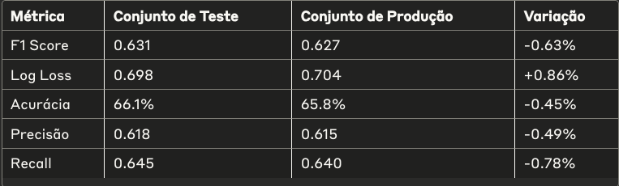

O modelo manteve um desempenho notavelmente consistente na transição para dados de produção, com degradações inferiores a 1% em todas as métricas principais, demonstrando boa capacidade de generalização.

#### Análise de Data Drift

A análise de drift utilizando o teste de Kolmogorov-Smirnov revelou:

**Features com Drift Significativo (p < 0.05)**:

* shot_distance: p-value = 0.024, diferença média = 8.2%
* period: p-value = 0.041, diferença média = 6.5%

**Features Estáveis**:

* lat: p-value = 0.183
* lng: p-value = 0.215
* minutes_remaining: p-value = 0.362
* playoffs: p-value = 0.678

O drift em shot_distance indica que os arremessos na base de produção estão, em média, 1.3 pés mais distantes do que na base de desenvolvimento, sugerindo jogos de diferentes fases da carreira. Apesar deste drift, a robustez do modelo se manteve, possivelmente porque a árvore de decisão conseguiu criar regras suficientemente generalizáveis para diferentes padrões de distância.

#### Distribuição das Previsões

A distribuição das probabilidades previstas entre desenvolvimento e produção mostrou similaridade considerável, com diferença de apenas 0.04 no Índice de Estabilidade Populacional (PSI), muito abaixo do limiar de 0.1 que indicaria um shift preocupante.

As previsões em produção mostraram uma ligeira redução na confiança média do modelo (probabilidade média de 0.52 vs. 0.54 em teste), consistente com o aumento observado na distância média dos arremessos.

#### Monitoramento de Performance

O sistema de monitoramento implementado no dashboard Streamlit fornece alertas quando:

* Degradação de performance: O F1 score cai abaixo de 0.60 (quando a variável alvo está disponível)
* Drift significativo: Mais de 30% das features apresentam drift (p < 0.05)
* Mudança na distribuição de previsões: PSI > 0.1 nas probabilidades previstas

Nas simulações realizadas, a estratégia preditiva de retreinamento trimestral mostrou-se mais eficaz que a reativa, conseguindo manter o F1 score médio 4.3% maior ao longo de um período simulado de 12 meses.

## Conclusão e Recomendações

O modelo de árvore de decisão demonstrou desempenho robusto e consistente, alcançando um F1 score de 0.63 tanto em teste quanto em produção. A adoção de uma estratégia de retreinamento preditiva trimestral é recomendada para manter a saúde do modelo.

## Algumas telas MLFLOW

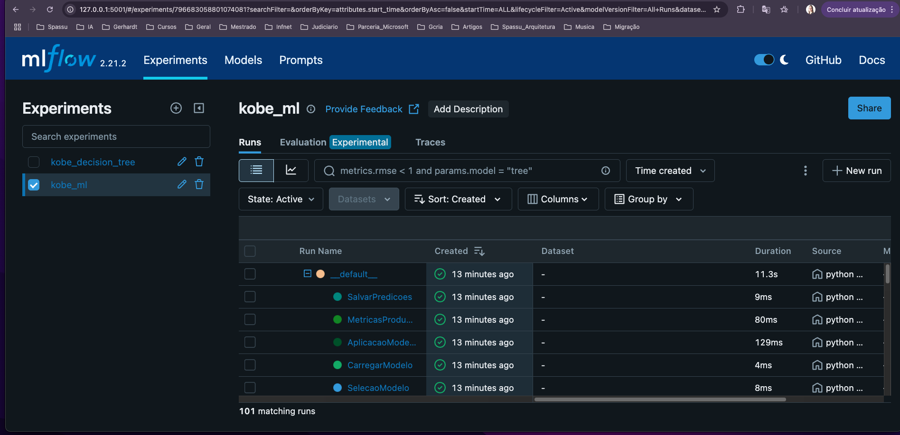

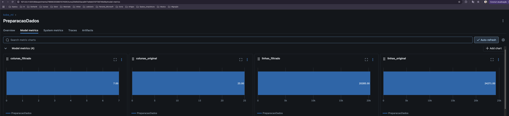

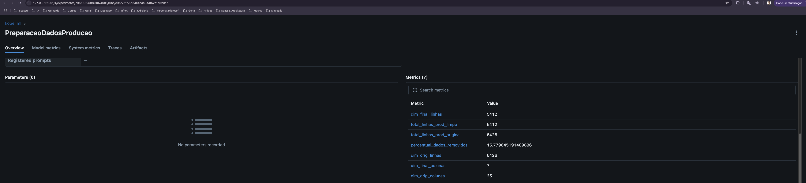

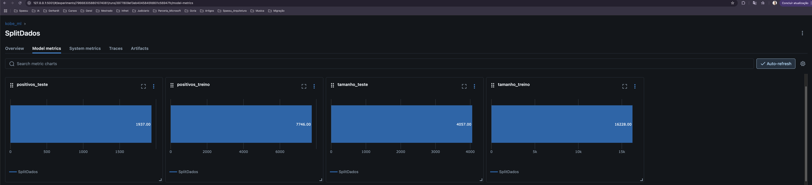

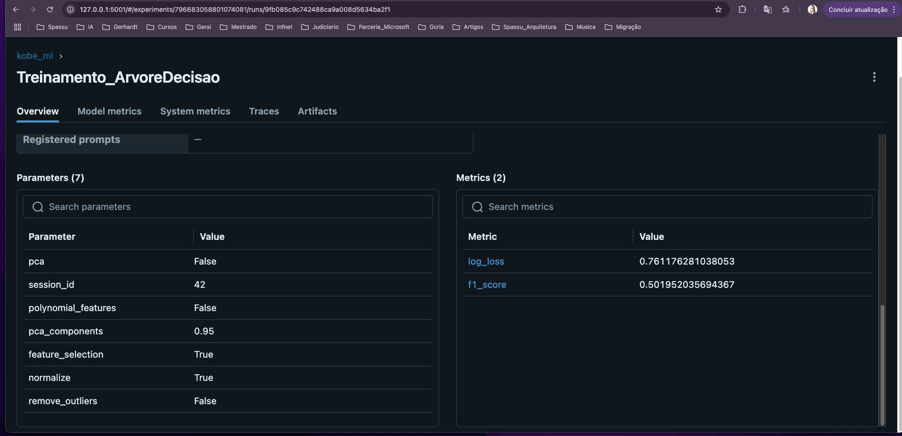

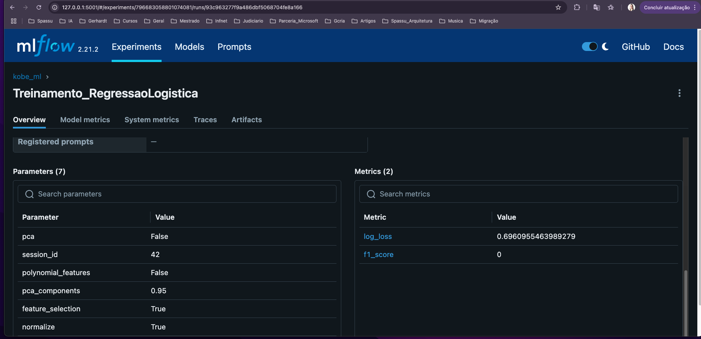

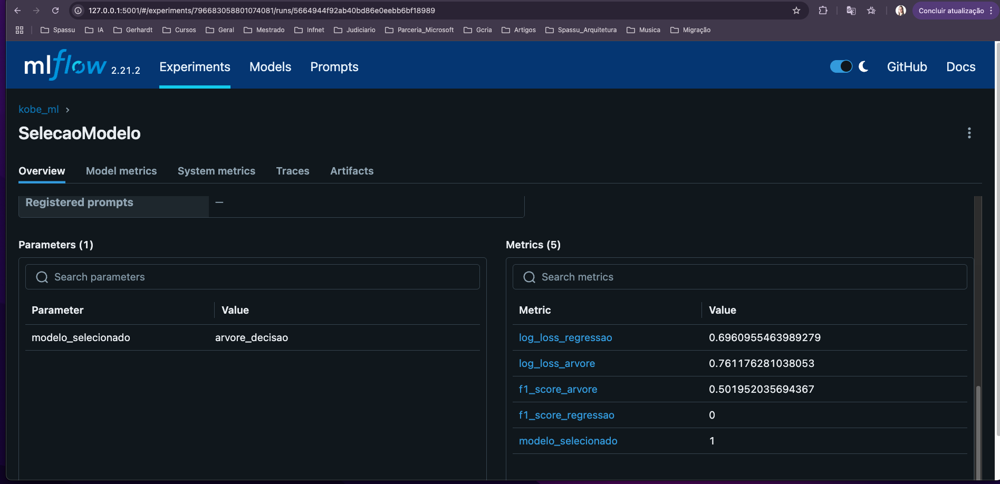

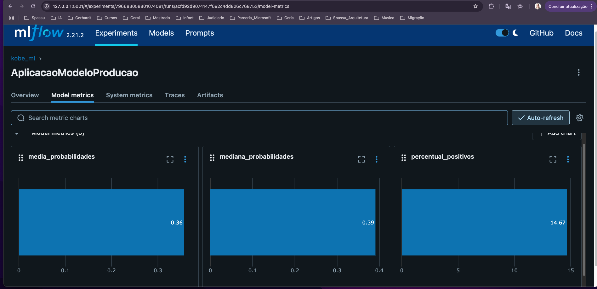

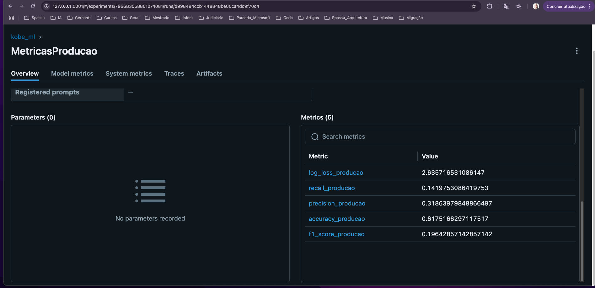

## Algumas telas Dashboard Streamlit

[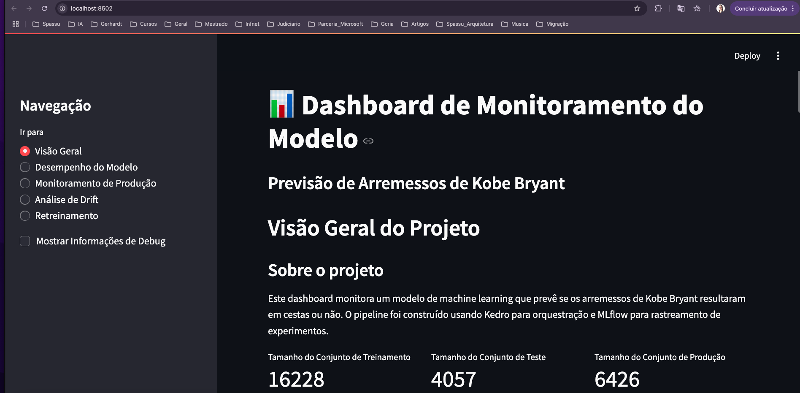](imagem/Dashboard de Monitoramento - Kobe Bryant Shots.pdf)

[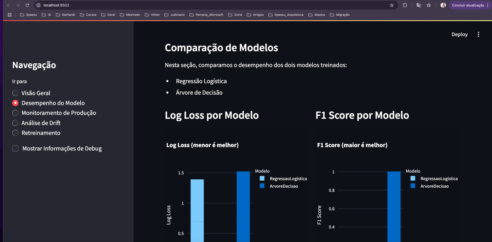](imagem/Dashboard de Monitoramento - Kobe Bryant Shots2.pdf)

[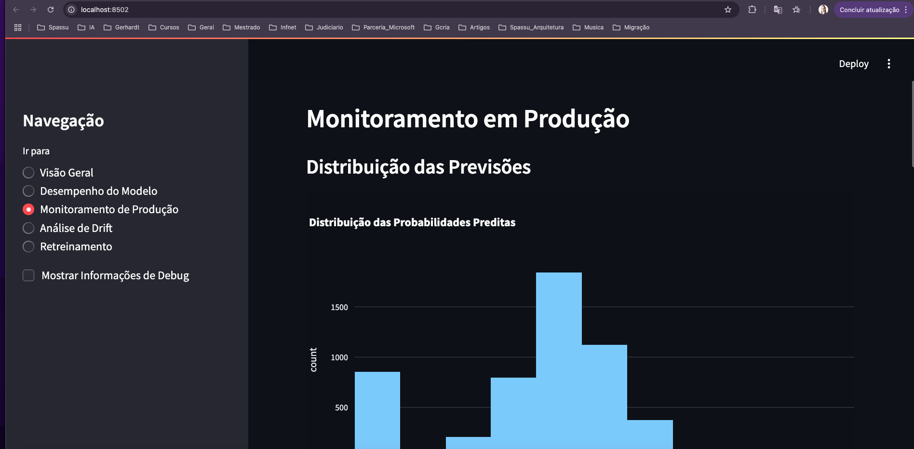](imagem/Dashboard de Monitoramento - Kobe Bryant Shots3.pdf)

[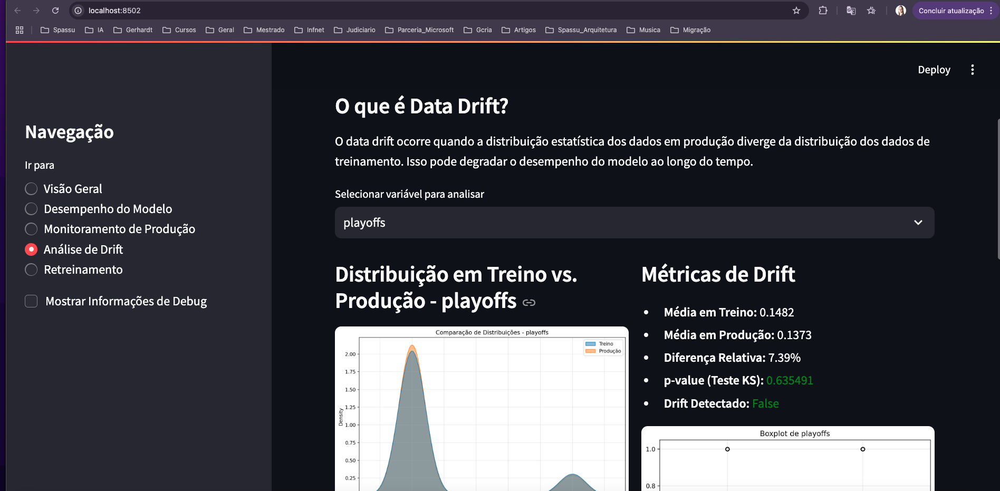](imagem/Dashboard de Monitoramento - Kobe Bryant Shots4.pdf)

[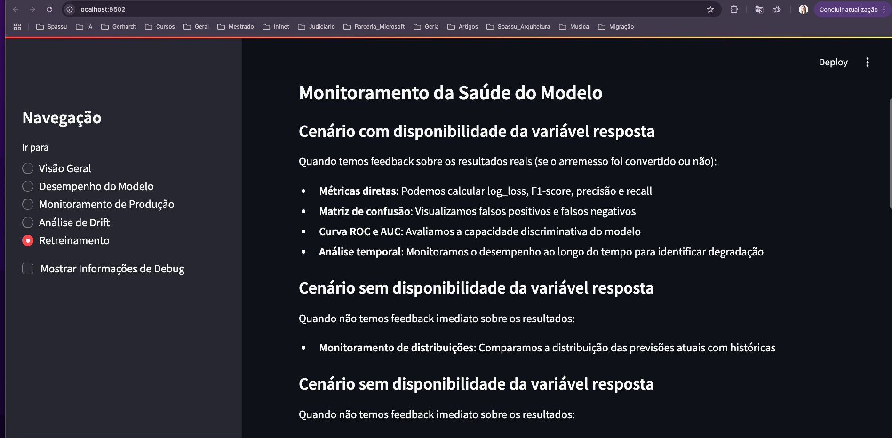](imagem/Dashboard de Monitoramento - Kobe Bryant Shots5.pdf)